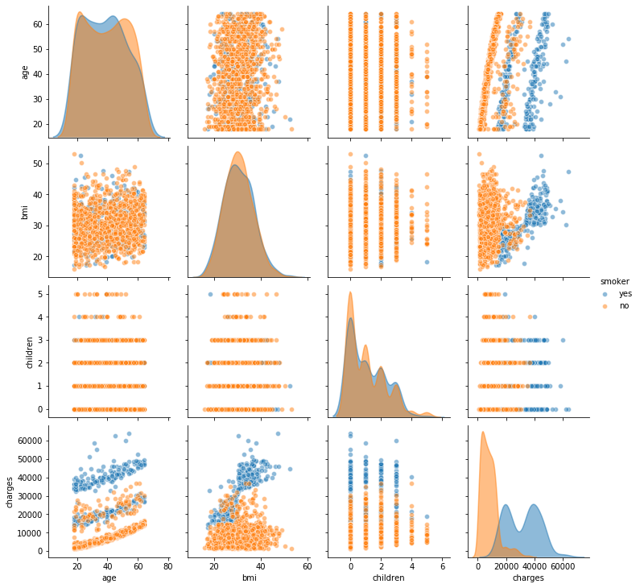
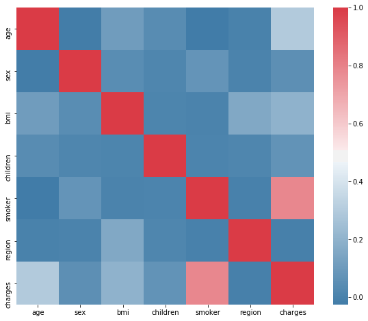

# 1er Demo - Data Science - `Medical Cost`

-----
## Jose Salazar - `Web Developer`
* https://twitter.com/salazarr_js
* https://github.com/salazarr-js
* https://linkedin.com/in/salazarr-js/
-----


## Contexto

El `dataset` que exploraremos es un conjunto de datos dedicado al costo del tratamiento de diferentes pacientes. No tenemos datos sobre el diagnóstico de los pacientes, pero tenemos otra información que puede ayudarnos a llegar a diferentes conclusiones utiles, como estimar los estados de salud de los pacientes, o predecir los costos de cuidados medicos.

## Contenido de columnas

- **`age`:** Edad del beneficiario principal.
- **`sex`:** Sexo del contratista del seguro, `female`, `male`.
- **`bmi`:** Índice de masa corporal, que proporciona una comprensión del cuerpo, pesos relativamente altos o bajos en relación con la altura, índice objetivo de peso corporal **(kg/m^2)** utilizando la relación de altura a peso.
- **`children`:** Número de niños cubiertos por seguro de salud | Número de dependientes.
- **`smoker`:** Si es fumador.
- **`region`:** El área residencial del beneficiario en US, `northeast`, `southeast`, `southwest`, `northwest`.
- **`charges`:** Costos médicos individuales facturados por el seguro de salud.


## Importación de librerias


```python
import numpy as np
import pandas as pd
import matplotlib.pyplot as plt
import seaborn as sns
```

## Carga de `dataset`


```python
df = pd.read_csv('insurance.csv')
```

## Exploración basica


```python
rows, columns = df.shape
print( 'Tenemos {} filas y {} columnas'.format(rows, columns) )
```

    Tenemos 1338 filas y 7 columnas


```python
df.head()
```


<div>
<style scoped>
    .dataframe tbody tr th:only-of-type {
        vertical-align: middle;
    }

    .dataframe tbody tr th {
        vertical-align: top;
    }

    .dataframe thead th {
        text-align: right;
    }
</style>
<table border="1" class="dataframe">
  <thead>
    <tr style="text-align: right;">
      <th></th>
      <th>age</th>
      <th>sex</th>
      <th>bmi</th>
      <th>children</th>
      <th>smoker</th>
      <th>region</th>
      <th>charges</th>
    </tr>
  </thead>
  <tbody>
    <tr>
      <th>0</th>
      <td>19</td>
      <td>female</td>
      <td>27.900</td>
      <td>0</td>
      <td>yes</td>
      <td>southwest</td>
      <td>16884.92400</td>
    </tr>
    <tr>
      <th>1</th>
      <td>18</td>
      <td>male</td>
      <td>33.770</td>
      <td>1</td>
      <td>no</td>
      <td>southeast</td>
      <td>1725.55230</td>
    </tr>
    <tr>
      <th>2</th>
      <td>28</td>
      <td>male</td>
      <td>33.000</td>
      <td>3</td>
      <td>no</td>
      <td>southeast</td>
      <td>4449.46200</td>
    </tr>
    <tr>
      <th>3</th>
      <td>33</td>
      <td>male</td>
      <td>22.705</td>
      <td>0</td>
      <td>no</td>
      <td>northwest</td>
      <td>21984.47061</td>
    </tr>
    <tr>
      <th>4</th>
      <td>32</td>
      <td>male</td>
      <td>28.880</td>
      <td>0</td>
      <td>no</td>
      <td>northwest</td>
      <td>3866.85520</td>
    </tr>
  </tbody>
</table>
</div>


```python
df.dtypes
```


    age           int64
    sex          object
    bmi         float64
    children      int64
    smoker       object
    region       object
    charges     float64
    dtype: object


```python
df.describe()
```


<div>
<style scoped>
    .dataframe tbody tr th:only-of-type {
        vertical-align: middle;
    }

    .dataframe tbody tr th {
        vertical-align: top;
    }

    .dataframe thead th {
        text-align: right;
    }
</style>
<table border="1" class="dataframe">
  <thead>
    <tr style="text-align: right;">
      <th></th>
      <th>age</th>
      <th>bmi</th>
      <th>children</th>
      <th>charges</th>
    </tr>
  </thead>
  <tbody>
    <tr>
      <th>count</th>
      <td>1338.000000</td>
      <td>1338.000000</td>
      <td>1338.000000</td>
      <td>1338.000000</td>
    </tr>
    <tr>
      <th>mean</th>
      <td>39.207025</td>
      <td>30.663397</td>
      <td>1.094918</td>
      <td>13270.422265</td>
    </tr>
    <tr>
      <th>std</th>
      <td>14.049960</td>
      <td>6.098187</td>
      <td>1.205493</td>
      <td>12110.011237</td>
    </tr>
    <tr>
      <th>min</th>
      <td>18.000000</td>
      <td>15.960000</td>
      <td>0.000000</td>
      <td>1121.873900</td>
    </tr>
    <tr>
      <th>25%</th>
      <td>27.000000</td>
      <td>26.296250</td>
      <td>0.000000</td>
      <td>4740.287150</td>
    </tr>
    <tr>
      <th>50%</th>
      <td>39.000000</td>
      <td>30.400000</td>
      <td>1.000000</td>
      <td>9382.033000</td>
    </tr>
    <tr>
      <th>75%</th>
      <td>51.000000</td>
      <td>34.693750</td>
      <td>2.000000</td>
      <td>16639.912515</td>
    </tr>
    <tr>
      <th>max</th>
      <td>64.000000</td>
      <td>53.130000</td>
      <td>5.000000</td>
      <td>63770.428010</td>
    </tr>
  </tbody>
</table>
</div>


```python
df.mode()
```


<div>
<style scoped>
    .dataframe tbody tr th:only-of-type {
        vertical-align: middle;
    }

    .dataframe tbody tr th {
        vertical-align: top;
    }

    .dataframe thead th {
        text-align: right;
    }
</style>
<table border="1" class="dataframe">
  <thead>
    <tr style="text-align: right;">
      <th></th>
      <th>age</th>
      <th>sex</th>
      <th>bmi</th>
      <th>children</th>
      <th>smoker</th>
      <th>region</th>
      <th>charges</th>
    </tr>
  </thead>
  <tbody>
    <tr>
      <th>0</th>
      <td>18</td>
      <td>male</td>
      <td>32.3</td>
      <td>0</td>
      <td>no</td>
      <td>southeast</td>
      <td>1639.5631</td>
    </tr>
  </tbody>
</table>
</div>


```python
df.median()
```


    age           39.000
    bmi           30.400
    children       1.000
    charges     9382.033
    dtype: float64


## Visualizaciones basicas


```python
sns.pairplot(data=df,
             plot_kws={'alpha': 0.5}, 
             diag_kws={'alpha': 0.5}) 
```


    <seaborn.axisgrid.PairGrid at 0x12cba6110>


```python
sns.pairplot(data=df, 
             hue="smoker", 
            #  diag_kind="hist",
             plot_kws={'alpha': 0.5}, 
             diag_kws={'alpha': 0.5}) 
```


    <seaborn.axisgrid.PairGrid at 0x12d6d8dd0>





## Primeras impresiones `anotaciones`

### `age`
- [x] Que rango de edades tienen mayor densidad?
- [ ] Que rango de edades suelen fumar mas?
- [ ] Que rango de edades tienen la mayor cantidad de obesos?
- [ ] Que rando de edades tienen la mayor cantidad de hijos?
- [ ] Que rango de edades suelen tener mayor gastos medicos?
- [ ] La edad afecta los gastos medicos?

### `sex`
- [x] Que genero tiene la mayor densidad?
- [ ] Que genero suele fumar mas?
- [ ] Que genero tiene la mayor cantidad de obesos?
- [ ] Que genero tiene la mayor cantidad de hijos?
- [ ] Que genero suele tener mayor gasto medico?
- [x] El genero afecta el gasto medico?

### `bmi`
- [ ] Que rango de bmi tiene mayor densidad?
- [ ] El bmi afecta el gasto medico?

- [X] El promedio del `BMI` indica que hay un indice de `Obesidad` alto


### `children`
- [ ] Que cantidad de hijos tiene mayor densidad
- [ ] Los padres con hijos fuman?

### `smoker`
- [ ] Densidad de fumadores
- [ ] Los fumadores tienen mayor gastos medicos?

### `region`
- Que region tiene mayor densidad

### `charges`
- Los gastos medicos aumentan en relacion a la `edad`
- los gastos medicos se ven grandemente afectados por `smoker`

## Consideraciones 🚸

> - No tenemos datos o columnas con fechas por tanto no es necesario procesarlas `parse_dates`
> - Se pueden considerar como `dummies` los datos de las columnas `sex`, `smoker`, de manera que procesandolas pueda ser mas facil analizarlas [link](#Codificación-de-características-categóricas.)
> - Se pueden agregar mas columnas para representar la columna `BMI` columnas `dummies` segun si pertenece a los diferentes grupos `underweight`, `normal`, `overweight`, `obese`, `extremely_obese` [link](#Codificación-de-características-categóricas.)
> - Se pueden mapear los valores de la columna `smoker` a valores `booleanos` [link](#Codificación-de-características-categóricas.)
> - Es posible que se encuentren datos atipicos `outliers` en la columna `BMI`
> - La `correlación` no toma de manera correcta las columnas `sex` y `smoker` pero se pueden codificar [link](#Codificación-de-características-categóricas.)
> - La columna `bmi` actualmente es numerica pero puede ser facilmente transportada a su versión categórica solo para facilitar algunas concluciones

## Valores Faltantes


```python
df.isna().sum()
```


    age         0
    sex         0
    bmi         0
    children    0
    smoker      0
    region      0
    charges     0
    dtype: int64


### Anotaciones
> A pesar que nuestro `dataset` es pequeño ya esta limpia y sin valores `NaN`, por lo cual no necesita que implementemos acciones especificas con los valores faltantes 🍻

## Conversión de características/variables categóricas

Para que la correlacion nos de valores significativos en relacion a las columnas `sex` y `smoker`, las cuales podemos considerar como `categoricas`, las manejaremos como variables `dummies` y las codificaremos o mapearemos a valores enteros.


```python
from sklearn.preprocessing import LabelEncoder
```


```python
le = LabelEncoder()

# SEX
le.fit(df.sex.drop_duplicates()) 
df.sex = le.transform(df.sex)

# SMOKER
le.fit(df.smoker.drop_duplicates()) 
df.smoker = le.transform(df.smoker)

# REGION
le.fit(df.region.drop_duplicates()) 
df.region = le.transform(df.region)

df.head()
```


<div>
<style scoped>
    .dataframe tbody tr th:only-of-type {
        vertical-align: middle;
    }

    .dataframe tbody tr th {
        vertical-align: top;
    }

    .dataframe thead th {
        text-align: right;
    }
</style>
<table border="1" class="dataframe">
  <thead>
    <tr style="text-align: right;">
      <th></th>
      <th>age</th>
      <th>sex</th>
      <th>bmi</th>
      <th>children</th>
      <th>smoker</th>
      <th>region</th>
      <th>charges</th>
    </tr>
  </thead>
  <tbody>
    <tr>
      <th>0</th>
      <td>19</td>
      <td>0</td>
      <td>27.900</td>
      <td>0</td>
      <td>1</td>
      <td>3</td>
      <td>16884.92400</td>
    </tr>
    <tr>
      <th>1</th>
      <td>18</td>
      <td>1</td>
      <td>33.770</td>
      <td>1</td>
      <td>0</td>
      <td>2</td>
      <td>1725.55230</td>
    </tr>
    <tr>
      <th>2</th>
      <td>28</td>
      <td>1</td>
      <td>33.000</td>
      <td>3</td>
      <td>0</td>
      <td>2</td>
      <td>4449.46200</td>
    </tr>
    <tr>
      <th>3</th>
      <td>33</td>
      <td>1</td>
      <td>22.705</td>
      <td>0</td>
      <td>0</td>
      <td>1</td>
      <td>21984.47061</td>
    </tr>
    <tr>
      <th>4</th>
      <td>32</td>
      <td>1</td>
      <td>28.880</td>
      <td>0</td>
      <td>0</td>
      <td>1</td>
      <td>3866.85520</td>
    </tr>
  </tbody>
</table>
</div>


### Observaciones
> - En principio iba a usar la funcion `.get_dummies()`
> - La funcion `.map()` tambien era una opcion, que me ayudaba a mapear valores usando un `dict`, util en el caso de `sex` `smoker` y `region`

## Correlación


```python
plt.subplots(figsize=(10, 8))

sns.heatmap(df.corr(), cmap=sns.diverging_palette(240, 10, as_cmap=True), square=True)
```


    <matplotlib.axes._subplots.AxesSubplot at 0x12dff02d0>





### Observaciones

-----
- [Kaggle Link](https://www.kaggle.com/mirichoi0218/insurance)
- [Repo Link](https://github.com/salazarr-js/acamica-ds-demo-1)

